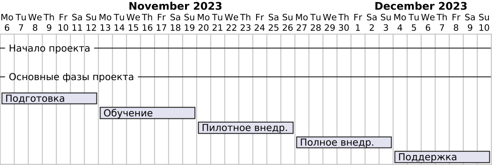

# План внедрения

## Неделя 1: Подготовка к внедрению

- **День 1-3:** Завершение тестирования и отладки.
- **День 4-6:** Подготовка и проверка документации.
- **День 7:** Создание резервных копий текущих данных и систем.

## Неделя 2: Обучение пользователей

- **День 8-10:** Проведение обучающих семинаров для администраторов.
- **День 11-13:** Проведение обучающих семинаров для преподавателей.
- **День 14:** Проведение обучающих семинаров для студентов.

## Неделя 3: Пилотное внедрение

- **День 15-17:** Запуск пилотной версии приложения для ограниченной группы пользователей.
- **День 18-20:** Сбор обратной связи от пилотной группы пользователей.
- **День 21:** Анализ обратной связи и внесение необходимых корректировок.

## Неделя 4: Полное внедрение

- **День 22-24:** Развертывание приложения для всех пользователей.
- **День 25-27:** Мониторинг работы системы и оперативное решение возникающих проблем.
- **День 28:** Окончательная проверка и закрытие проекта.

## Неделя 5: Поддержка и сопровождение

- **День 29-31:** Обеспечение технической поддержки пользователям.
- **День 32-34:** Сбор и анализ данных о работе системы.
- **День 35:** Планирование дальнейших улучшений и обновлений.
- 

## [К содержанию](../Документация/content.md)