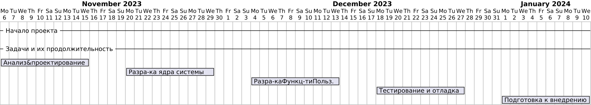

# План разработки

## Неделя 1-2: Анализ и проектирование

- **День 1-3:** Сбор и анализ требований.
- **День 4-6:** Проектирование архитектуры системы.
- **День 7-9:** Создание прототипа интерфейса.

## Неделя 3-4: Разработка ядра системы

- **День 10-12:** Настройка базы данных и создание моделей данных.
- **День 13-15:** Реализация основных функций управления курсами.
- **День 16-18:** Реализация функций управления пользователями.

## Неделя 5-6: Разработка функциональности пользователей

- **День 19-21:** Реализация функций для студентов.
- **День 22-24:** Реализация функций для преподавателей.
- **День 25-27:** Реализация функций для администраторов.

## Неделя 7-8: Тестирование и отладка

- **День 28-30:** Проведение модульного тестирования.
- **День 31-33:** Проведение интеграционного тестирования.
- **День 34-36:** Проведение системного тестирования и отладка.

## Неделя 9: Подготовка к внедрению

- **День 37-39:** Подготовка документации.
- **День 40-42:** Обучение пользователей и финальная подготовка к внедрению.  
 
