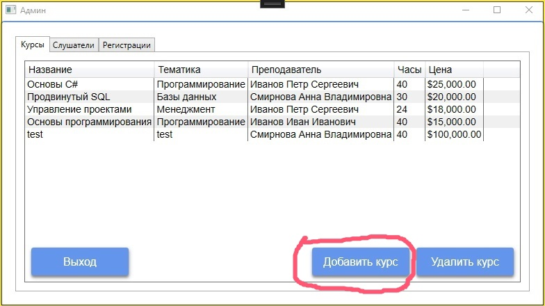
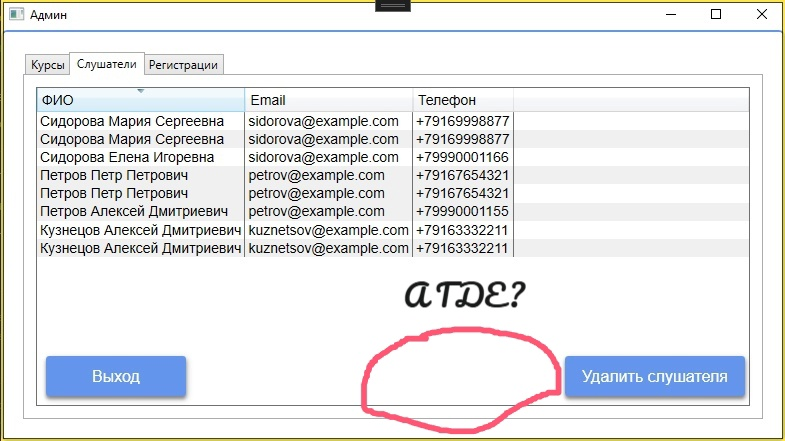

# В данном документе будет представлены: способ связи с разработчиком и пример заявки для пользователя.

## Отправка письма:

- Отправьте письмо на адрес: qcsupport.team@gmail.com.
- В теме письма укажите краткое описание проблемы или предложения.
- В теле письма предоставьте подробное описание проблемы, включая шаги для её воспроизведения, ожидаемое и фактическое поведение.
- При необходимости прикрепите к письму скриншоты или другие файлы, которые помогут понять проблему.

## Пример заявки
---
## Добавление важных функций для администратора.

### Здравствуйте, уважаемые QCSupportTM!

При работе с вашим приложением в качестве админа возникает такой батхёрт: при появлении новых студентов в нашем вузе, приходится добавлять их, взаимодействуя с базой данных, что неудобно и долго.  
  
Мое предложение заключается в создании функции добавления новых студентов прямо в приложении, чтобы избежать лишних трудностей в виде взаимодействия с базой данных.

