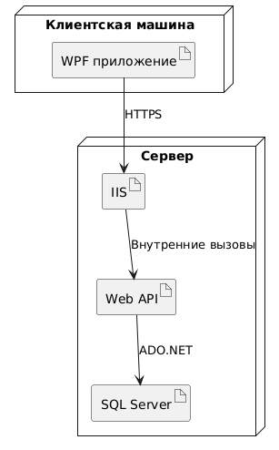

# Руководство по развертыванию

## Введение
Этот раздел предназначен для помощи администраторам и разработчикам в развертывании системы. Здесь описаны шаги по установке и настройке системы.

## Требования к системе
- Операционная система: Windows 10 или выше.
- .NET Framework 4.7.2 или выше.
- SQL Server 2016 или выше.

## Установка системы
1. **Установка базы данных**:
   - Установите SQL Server на сервер.
   - Создайте новую базу данных для системы.
   - Выполните скрипты для создания таблиц и начальных данных.

2. **Установка приложения**:
   - Скопируйте файлы приложения на сервер.
   - Настройте файл конфигурации приложения, указав параметры подключения к базе данных.

3. **Запуск приложения**:
   - Запустите приложение.

## Настройка системы
1. **Настройка подключения к базе данных**:
   - Откройте файл конфигурации приложения.
   - Укажите параметры подключения к базе данных, такие как строка подключения.

2. **Настройка пользователей**:
   - Создайте начальных пользователей в системе.
   - Назначьте роли пользователям.

