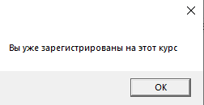

# РУКОВОДСТВО ПОЛЬЗОВАТЕЛЯ ДЛЯ ПРИЛОЖЕНИЯ УПРАВЛЕНИЯ КУРСАМИ

## АННОТАЦИЯ

Это руководство предназначено для пользователей приложения управления курсами, которое позволяет управлять учебными курсами, регистрацией студентов, преподавателями и расписанием. Оно содержит информацию о назначении программы, её возможностях, условиях применения, а также пошаговые инструкции по установке, настройке и использованию всех ключевых функций. Руководство включает советы по устранению распространенных ошибок и проблем, возникающих при работе с программой.

## ВВЕДЕНИЕ

Приложение управления курсами — это инструмент для управления учебными процессами. Оно предоставляет широкий спектр возмежностей для создания и управления курсами, регистрации студентов, назначения преподавателей и отслеживания посещаемости. Программа поддерживает работу с различными данными, позволяя эффективно управлять учебными процессами.

## 1. ОБЛАСТЬ ПРИМЕНЕНИЯ

Приложение управления курсами предназначено для использования в образовательных учреждениях, таких как школы, колледжи и университеты. Оно подходит для управления учебными курсами, регистрацией студентов, назначения преподавателей и отслеживания посещаемости.

## 2. КРАТКОЕ ОПИСАНИЕ ВОЗМОЖНОСТЕЙ

- **Управление курсами**: создание, редактирование и удаление курсов.
- **Регистрация студентов**: регистрация студентов на курсы, отслеживание их успеваемости.
- **Назначение преподавателей**: назначение преподавателей на курсы, управление их расписанием.
- **Отслеживание посещаемости**: ведение записей о посещаемости студентов.
- **Тестирование и сертификация**: проведение тестов и выдача сертификатов студентам.
- **Экспорт данных**: сохранение данных в различных форматах, таких как PDF и Excel.

## 3. УРОВЕНЬ ПОДГОТОВКИ ПОЛЬЗОВАТЕЛЯ

Для начала работы с приложением управления курсами достаточно базовых навыков работы с компьютером и стандартными офисными приложениями. Однако для освоения более сложных функций, таких как настройка базы данных или расширенное управление курсами, потребуется определенный опыт и знания.

## 4. СПИСОК ОБОЗНАЧЕНИЙ И СОКРАЩЕНИЙ

- **UI** – User Interface (Пользовательский интерфейс)
- **GUI** – Graphical User Interface (Графический пользовательский интерфейс)
- **DB** – Database (База данных)
- **PDF** – Portable Document Format
- **CSV** – Comma-Separated Values (Значения, разделённые запятыми)

## 5. НАЗНАЧЕНИЕ И УСЛОВИЯ ПРИМЕНЕНИЯ

Приложение управления курсами предназначено для управления учебными процессами в образовательных учреждениях. Оно позволяет пользователям эффективно управлять курсами, регистрацией студентов, преподавателями и расписанием.

### 5.1 Условия применения

Для работы с приложением управления курсами необходимо иметь компьютер с установленной операционной системой Windows или macOS, а также доступ к базе данных. Минимальные системные требования зависят от версии приложения и могут варьироваться.

## 6. ПОДГОТОВКА К РАБОТЕ

### [См. Руководство Разработчика](/РуководствоРазработчика(ВнедрениеИРазвертка).md)

## 7. ОПИСАНИЕ ОПЕРАЦИЙ

### Просмотр информации, доступной определенной роли
1. Авторизуйтесь как учитель, студент, или администратор.
2. Перемещайтесь между вкладками «Мои курсы», «Регистрации», «Курсы», «Расписание», «Слушатели», «Посещаемость», «Аттестация».

### Создание нового курса

1. Авторизуйтесь как администратор.

2. Выберете вкладку «Курсы» → нажмите кнопку «Добавить курс».

3. Заполните необходимые поля, такие как название курса, описание, тематика, количество часов и цена.  

4. Назначьте преподавателя и сохраните курс.  

### Удаление курса

1. Авторизуйтесь как администратор.

2. Выберете вкладку «Курсы» → выберите курс, кликнув по нему → нажмите кнопку «Удалить курс» .

### Поиск курса

1. Авторизуйтесь как студент.  
2. Выберете вкладку «Каталог курсов» → введите в поле название желаемого курса.  
3. Нажмите кнопку «Поиск».
4. Должны появиться курсы, которые вам необходимы.  

### Запись на курс

1. Авторизуйтесь как студент.  
2. Выберете вкладку «Мои курсы» → кликните на желаемый курс → нажмите кнопку «Зарегистрироваться»
3. Теперь, в зависимости от того, зарегистрированны ли вы на курс, должно появиться диалоговое окно с текстом «Вы уже зарегистрированны на этот курс» или же «Вы успешно зарегистрированны на этот курс»
 

### Прохождение теста и выдача сертификата в формате Excel

1. Авторизуйтесь как студент.  
2. Выберете вкладку «Каталог курсов» → кликните на желаемый курс → нажмите кнопку «Пройти тест».

3. После предыдущего действия должно открыться модальное окно с вопросами и вариантами ответов на эти вопросы, вам нужно выбрать ответы и нажать кнопку «Завершить тест».

4. На экране должно появиться диалоговое окно с вашим результатом, жмите «ОК».   

5. Далее должно появиться окно проводника, где вам нужно указать путь сохранения и название файла.

### Отслеживание посещаемости

1. Авторизуйтесь как учитель.
2. Выберите вкладку «Посещаемость» → кликните на студента  → нажмите кнопку «Отметить присутствие».

3. Проверьте, появилась/исчезла галочка в столбце «Присутствие».

### Экспорт информации о студенте в .txt 

1. Авторизуйтесь как учитель.
2. Выберите вкладку «Посещаемость» → кликните на студента  → нажмите кнопку «Экспорт в .txt».

3. В выпавшем окне проводника выберите путь сохранения и название файла.

## 8. ВОЗМОЖНЫЕ ОШИБКИ И РЕКОМЕНДАЦИИ ПО УСТРАНЕНИЮ

### Ошибка: Невозможно изменить название, тему и тд и тп во вкладках учителя и студента

- **Причина**: Студент и учитель не имеют права редактировать, удалять, и сохранять данные.
- **Решение**: Не пытаться больше пробовать изменять что либо, будучи в роли студента или учителя.

### Ошибка: Программа работает, но при вводе корректных данных логина и пароля студента/учителя/администратора все равно выпадает ошибка

- **Причина**: Проблема в ссылке подключения к вашему серверу.
- **Решение**: Корректно заполните ссылку вашими данными.

## [К содержанию](../Документация/content.md)
